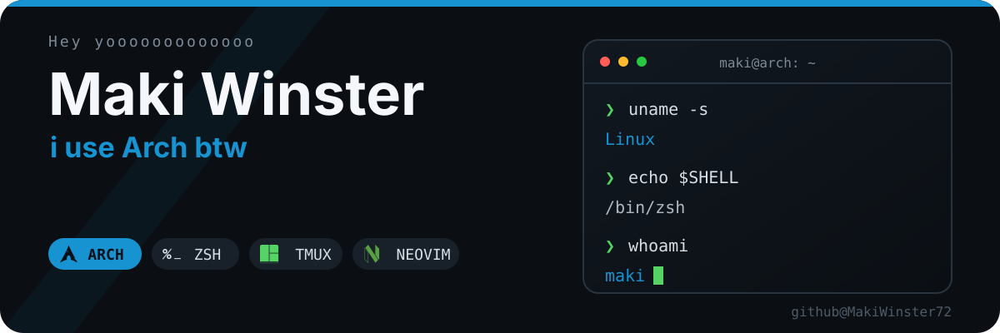

  

## `whoami`

> Maki anything kickass.

> 成为万里挑一，追求热爱 · 追求自由

## `connect`

- **Homepage:** [makis-life.cn](https://makis-life.cn)
- **Email:** [makiiiiiiiho@gmail.com](mailto:makiiiiiiiho@gmail.com)
- **GPG:** [`6D6B B3FA`](https://keys.openpgp.org/search?q=0F8EFF9D25063A59D756EA9E46BA4E906D6BB3FA)
- **Previous account:** [@MakiWinster](https://github.com/MakiWinster) — lost after a GitHub 2FA issue
